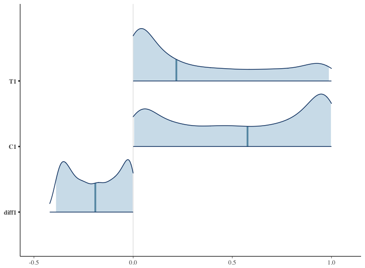

# Ordered Logit in Stan

## データ
年齢と性別によってそれぞれの選択肢(0,1,2,3,4の5つ)を選ぶ確率が変わるようにし、生成。

## 出力された図
図の上が処置群においてその選択肢が選ばれる確率、真ん中が統制群においてその選択肢が選ばれる確率、下が両者の差。
(値を作るときに、treatment以外はmeanの値を入れてしまってOK?)


選択肢1:<br>

<br><br>
選択肢2:<br>

<br><br>
選択肢5:<br>


## MASS Ordered Logitの結果
```r
> res <- polr(as.factor(Y)~treatment+age+gender, data=data, Hess=T)
> summary(res)
Call:
polr(formula = as.factor(Y) ~ treatment + age + gender, data = data, 
    Hess = T)

Coefficients:
             Value Std. Error t value
treatment  1.33133    0.21883   6.084
age       -0.01838    0.01113  -1.651
gender     0.35025    0.20951   1.672

Intercepts:
    Value   Std. Error t value
1|2 -2.4883  0.4662    -5.3374
2|3 -0.2680  0.4280    -0.6262
3|4  0.6038  0.4306     1.4023
4|5  1.6151  0.4406     3.6656

Residual Deviance: 871.8347 
AIC: 885.8347
```
