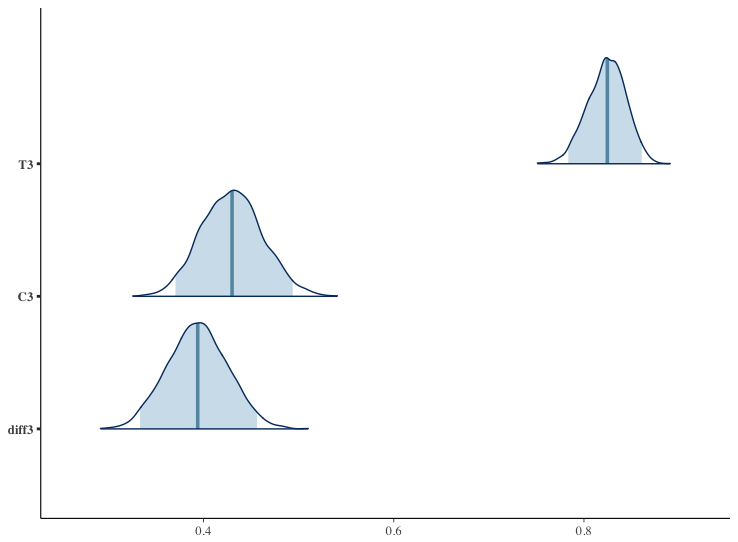

# Ordered Logit in Stan

## データ
順序ロジットのデータ生成過程に基づき擬似データを作成。
```r
> table(data$Y, data$treatment)   
      0   1
  1 120  52
  2 129 128
  3 168 220
  4  55 128
```

## 出力された図
図の上が処置群においてその選択肢が選ばれる確率、真ん中が統制群においてその選択肢が選ばれる確率、下が両者の差。
(差の事後分布からサンプリングする際に、treatment以外はmeanの値を入れている。本当はUCLAのみたいに段階的に値を変えた方が良いのかものそれぞれからサンプリングした方が良いのかもしれない)

選択肢1:<br>

<br><br>
選択肢2:<br>

<br><br>
選択肢3:<br>

<br><br>
選択肢4:<br>

<br><br>
betas:<br>

<br><br>
cutpoints:<br>

<br><br>
